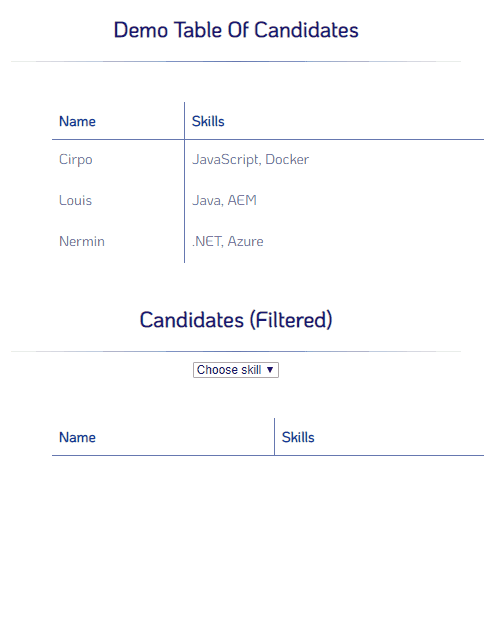

## Completed
- Split index.html into index.html, script.js & main.css
- Use filter to remove candidates who don't list JS.
- Check filter function when given other skills.
- Create dropdown to filter within table.
- Add CSS styling to tables.

## To-Do
- Nothing! :)

